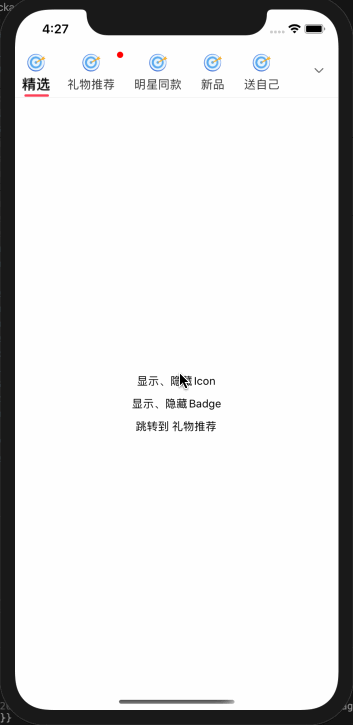
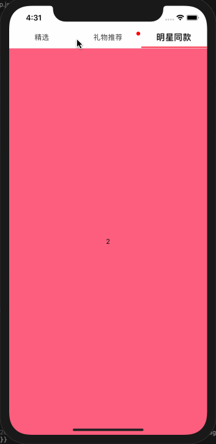
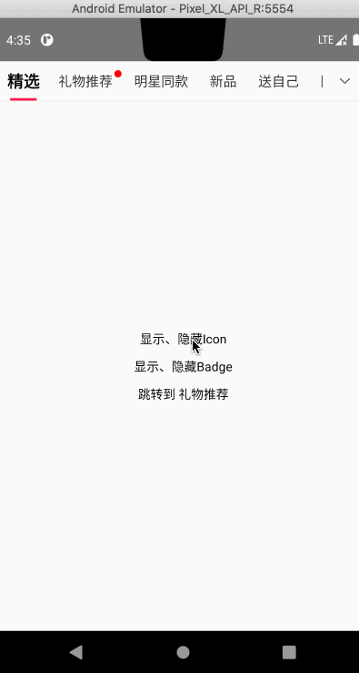
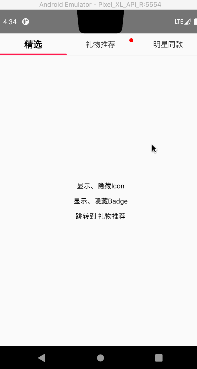
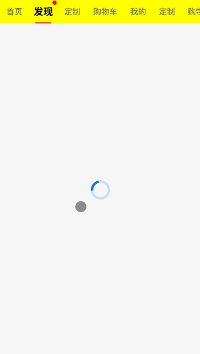

# @react-native-diy/tabview

一个好用的 TabView 组件，主要基于`@react-native-community/viewpager`封装，同时配合`react-native-web`也支持在 Web 上使用

此组件主要是由`TabBar`和`MyViewPager`两部分组成：

`TabBar`是基于`ScrollView`封装而成，支持文字随着滚动一直居中，支持指示器（下划线）随着文字长度而自行变化，也支持调整指示器（下划线）的长度比率，同时也支持**滚动**和**固定**模式

`MyViewPager`是基于`@react-native-community/viewpager`封装而成，为了支持`Web`，特地使用`ScrollView`封装了`MyViewPager.web.tsx`

## 安装

```
npm install @react-native-community/viewpager @react-native-diy/tabview --save
or
yarn add @react-native-community/viewpager @react-native-diy/tabview
```

## 使用

```javascript
import TabView from "@react-native-diy/tabview";

<TabView
  style={{ marginTop: IS_ANDROID ? 0 : statusBarHeight }}
  navigationState={data}
  tabBarStyle={{ borderBottomColor: "#eeeeee", borderBottomWidth: 1 }}
  renderTabBarRightSection={() => (
    <View
      style={{
        width: 50,
        justifyContent: "center",
        alignItems: "center",
      }}
    >
      <Image
        style={{ width: 20, height: 20 }}
        source={require("./arrow_down.png")}
      />
    </View>
  )}
  renderScene={(props) => {
    const { index } = props;
    if (index === 0) {
      return (
        <ChoiceScene
          {...props}
          switchIcon={switchIcon}
          switchBadge={switchBadge}
        />
      );
    }
    if (index === 1) {
      return <ListScene {...props} />;
    }
    return <OtherScene {...props} />;
  }}
  tabBarIndicatorMode={"label"}
  tabBarMode={"scrollable"}
/>;
```

具体使用见 [App.js](example/App.js)

## 支持的属性

| 属性                        | 描述                                                                                                                          |
| --------------------------- | ----------------------------------------------------------------------------------------------------------------------------- |
| style                       | TabView 容器的样式                                                                                                            |
| navigationState             | 数据源（必传）, 格式[{ key: '1', title: '精选', icon: 'require("./target.png")' , badge: ''}]，icon 和 badge 是可选的         |
| renderTabBar                | 自定义 TabBar， 传空则不显示                                                                                                  |
| tabBarPosition              | TabBar 位置， "top"、"bottom"可选                                                                                             |
| tabBarStyle                 | TabBar 容器的样式                                                                                                             |
| tabBarContentContainerStyle | TabBar 内容的样式，理解为 ScrollView 的 [contentContainerStyle](https://reactnative.cn/docs/scrollview#contentcontainerstyle) |
| tabBarTabStyle              | TabBar 每个 Tab 的样式                                                                                                        |
| tabBarLabelStyle            | TabBar 每个 Label 的样式                                                                                                      |
| tabBarIndicatorStyle        | TabBarIndicator 的样式                                                                                                        |
| tabBarActiveColor           | TabBar 中单个 Tab 未选中的背景颜色，默认透明                                                                                  |
| tabBarInactiveColor         | TabBar 中单个 Tab 选中的背景颜色，默认透明                                                                                    |
| scrollEnabled               | TabBar 是否能滚动，默认滚动                                                                                                   |
| bounces                     | TabBar 是否启用弹性效果，默认启用                                                                                             |
| onTabBarPress               | TabBar 单个 Tab 被选中的事件                                                                                                  |
| renderTabBarLabel           | 自定义 TabBar 中的 Label 组件，即文字标签                                                                                     |
| renderTabBarLeftSection     | TabBar 左边渲染的视图，扩展项，默认为空                                                                                       |
| renderTabBarRightSection    | TabBar 右边渲染的视图，扩展项，默认为空                                                                                       |
| tabBarIndicatorMode         | TabBarIndicator 的显示模式， "tab" 、"label"可选，                                                                            |
| tabBarIndicatorWidthRatio   | TabBarIndicator 宽度的显示比率，0 到 1 之间                                                                                   |
| tabBarMode                  | tabBar 的显示模式，"scrollable"、"fixed"可选                                                                                  |
| onIndexChange               | ViewPager 切换的事件                                                                                                          |
| renderScene                 | 渲染每个 Scene（必传），与 navigationState 的长度一致                                                                         |
| lazy                        | ViewPager 是否启用懒加载                                                                                                      |
| sceneContainerStyle         | Scene 的样式                                                                                                                  |
| renderLazyPlaceholder       | 当 Scene 没有加载渲染的视图                                                                                                   |
| keyboardDismissMode         | 与 ScrollView 的 [keyboardDismissMode](https://reactnative.cn/docs/scrollview#keyboarddismissmode) 一致                       |
| swipeEnabled                | ViewPager 是否启用滚动，默认开启                                                                                              |
| onSwipeStart                | 当 ViewPager 开始滚动的事件                                                                                                   |
| onSwipeEnd                  | 当 ViewPager 停止滚动的事件                                                                                                   |
| onPagerScroll               | ViewPager 滚动的事件                                                                                                          |
| initialIndex                | 初始显示的位置，默认 0                                                                                                        |

## 效果图

<center>
    
    
</center>
<center>
    
    
</center>
<center>
    
    
</center>

## 最后

如何对您有帮助的话，帮我 Star 下吧！☺️☺️☺️
